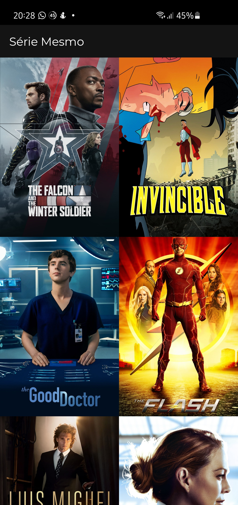
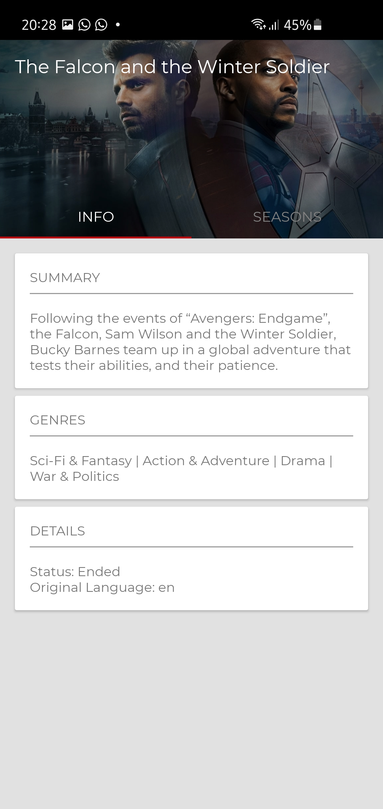
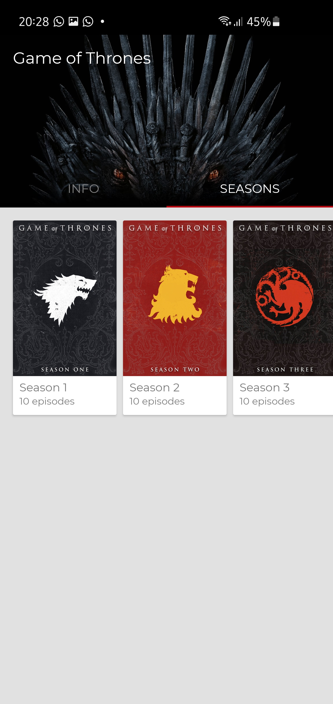
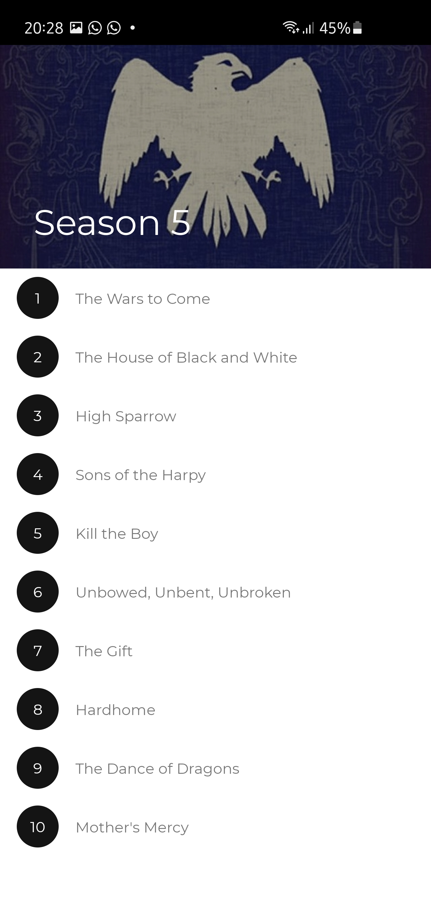
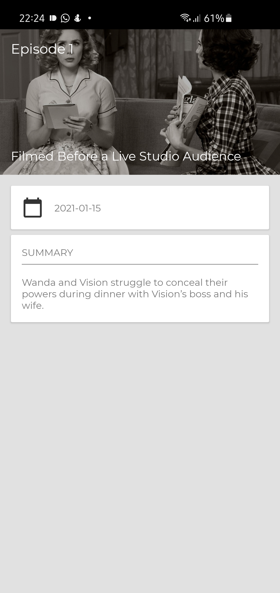

# Série Mesmo
"Série Mesmo" is a sample Android Application that loads TV Shows from https://www.themoviedb.org/ and displays the 20 most popular.

Among the displayed data, one can find
* Show info (summary, genres, details, list of seasons)
* Number of episodes for the season
* Episodes title, air date, and summary

Debug APK for the application can be found here: TODO() link

## Building the project
The app uses the TMDB API Version 3 to fetch content. In order to use this API, one must create an account on the TMDB website and generate a Key for the API. Instructions for generating the API key can be found here: https://developers.themoviedb.org/3/getting-started/authentication#application-authentication

After obtaining your API key, you must create a text file named "secure.properties" on the project root folder and add a line in this file containing the following content:

```TMDB_API_KEY=<your_api_key>```

replacing `<your_api_key>` with the value of the key you've generated before.

Please note that this file is not included on git versioning, and is manually excluded in .gitignore file, to avoid private API keys being leaked.

## Screenshots

<p align="center">
  
  
  
  
  
</p>

## UX Design
Visual interface of the app is based on a project that I've developed in 2015, while I was coursing MovileUP course. During the course, we had to develop a similar application, with a design provided by the course teachers.

## Architecture
The project was built on Clean Architecture, deeply integrated with RxJava for fetching data.
Some requirements are enforced through the architecture:
* Each Activity or Fragment must have its own ViewModel, be it simple or not. Although one can say there's no need for ViewModels on simple views that only display content pre-fetched (and that is true), this decision has been taken in order to keep consistence across the project and ensure the quality of features that will be added in the future.
* View Models are always created by factory classes.
* Each "feature" of the app must have its own use case. For example, for fetching the details of a season, a different API endpoint from the one for fetching the details of an episode should be called. Therefore, there must be two different UseCases in this example - one for each feature (fetching season details; fetching show details).

### Dependency Injection
KodeIn was chosen as the framework to facilitate dependency injection through the app.

### Presentation Layer
On the presentation layer, View Models are used to handle data visualization. Activities and Fragments interact with View Models in a reactive way, through the use of LiveData. The presentation layer communicates with the domain layer through UseCases, invoked by View Models.

### Domain Layer
This layer contains the "representation" of the business logic/features of the app. This representation exists through the use of UseCases. UseCases should invoke the Domain Layer (through repositories), map "data entities" to entities that are used in the rest of the app and should be kept as simple as possible. All UseCases must have a single public method called execute(). The method can receive as many parameters as needed and its return type should be exclusively one of the following: Single, Completable, or Observable. A single UseCase can use as many repositories are needed to perform its job.

### Data Layer
Data Layer contains repositories, data types that map to external API types and other things related to the app external communication. All API calls should be dispatched from this layer exclusively. This layer must never be accessed directly from the presentation layer. Repositories should be used by UseCases.

## Tests
Test classes were created in order to implement tests of some specific tests. The project is far away from 100% coverage, but this may be improved in the future. Tests were mainly implemented for example purposes.

ViewModel tests aimed to check if the correct state is set when both success and failure cases happen.

Repository implementation tests aimed to check if the values were emitted to consuming layers (success values with success data in success case and an exception in case of error).

UseCase tests aimed to check if the expected content was being returned. Success case and failure tests were not implemented, but they should be implemented as evolutions in the near future.

## Libraries used
* AndroidX
* KodeIn
* RxJava and RxAndroid
* MDC-Android
* Gson
* Retrofit
* Glide
* Live Events

## LICENSE
```
MIT License

Copyright (c) 2021 Bernardo do Amaral Teodosio

Permission is hereby granted, free of charge, to any person obtaining a copy
of this software and associated documentation files (the "Software"), to deal
in the Software without restriction, including without limitation the rights
to use, copy, modify, merge, publish, distribute, sublicense, and/or sell
copies of the Software, and to permit persons to whom the Software is
furnished to do so, subject to the following conditions:

The above copyright notice and this permission notice shall be included in all
copies or substantial portions of the Software.

THE SOFTWARE IS PROVIDED "AS IS", WITHOUT WARRANTY OF ANY KIND, EXPRESS OR
IMPLIED, INCLUDING BUT NOT LIMITED TO THE WARRANTIES OF MERCHANTABILITY,
FITNESS FOR A PARTICULAR PURPOSE AND NONINFRINGEMENT. IN NO EVENT SHALL THE
AUTHORS OR COPYRIGHT HOLDERS BE LIABLE FOR ANY CLAIM, DAMAGES OR OTHER
LIABILITY, WHETHER IN AN ACTION OF CONTRACT, TORT OR OTHERWISE, ARISING FROM,
OUT OF OR IN CONNECTION WITH THE SOFTWARE OR THE USE OR OTHER DEALINGS IN THE
SOFTWARE.
```
